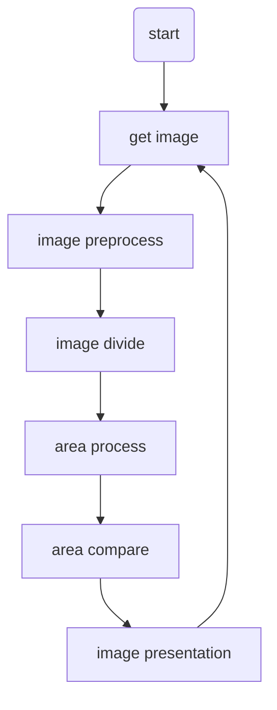

```mermaid
	graph TB
	L1(start) --> L2[get image]
	L2 --> L3[image preprocess]
	L3 --> L4[image divide]
	L4 --> L5[area process]
	L5 --> L6[area compare]
	L6 --> L7[image presentation]
	L7 --> L2
	
```

